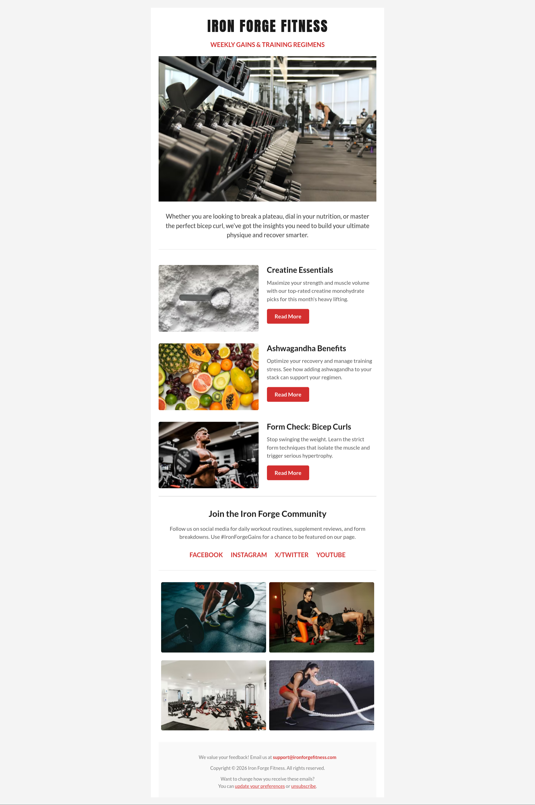
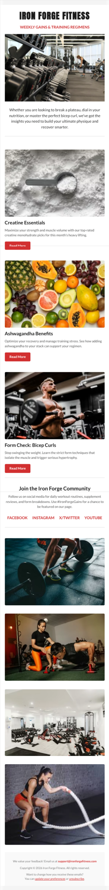

# 🏋️ Iron Forge Fitness - Newsletter Campaign
### A Responsive HTML Email Template Built for High Compatibility

| Desktop Preview | Mobile Preview |
| :--- | :--- |
|  |  |

## 📖 Project Overview
Email development requires a specialized approach compared to traditional web development. While modern browsers support advanced CSS, many email clients rely on legacy rendering engines that often break standard layouts.

This repository showcases a **production-ready health and fitness newsletter template**, designed to deliver training regimens, supplement insights, and community updates. It utilizes a robust hybrid-fluid architecture to ensure a high-energy brand experience across all platforms, ensuring the multi-column article layouts and lifestyle image grids look perfect in every inbox.

## 🛠️ Technical Implementation
To achieve maximum reliability and visual consistency, I implemented the following professional development standards:

* **Bulletproof Grid Architecture:** Engineered a responsive 2-column article layout and a 2x2 image grid using `display: inline-block` tables with strict `max-width` properties. Combined with a mobile-specific `.mobile-stack` class, this allows elements to sit side-by-side on desktop clients while smoothly stacking vertically on mobile screens.
* **Fluid Alignment & Safe Spacing:** Replaced standard CSS margins with strict padding and spacer rows to prevent layout collapse in Microsoft Word rendering engines. The fluid container strategy ensures elements align naturally across legacy clients without the need for conditional ghost tables.
* **Accessibility Standards:** Applied `role="presentation"` to all layout tables, ensuring that the structural code does not interfere with screen readers or assistive technology.
* **Inlined Styling & Web Fonts:** All core CSS is applied directly to elements to prevent styling loss in clients like Gmail. Integrated Google Fonts (`Anton` and `Lato`) with robust web-safe system fallbacks to maintain strong, impactful typography where external fonts are unsupported.

## 🚀 Platform Integration
The code is modular and clean, making it perfectly suited for integration into major Marketing Automation and CRM platforms, including:
* **Salesforce Marketing Cloud**
* **Mailchimp**
* **ActiveCampaign**
* **HubSpot**

## 📂 Repository Structure
* `index.html`: The core production-ready HTML code.
* `preview.jpg`: Visual representation of the desktop layout.
* `preview-mobile.jpg`: Visual representation of the mobile layout.

## 🤝 Contact
**Salah Attar** *Web & Email Developer* Focused on creating high-conversion, accessible, and technically robust digital experiences.
